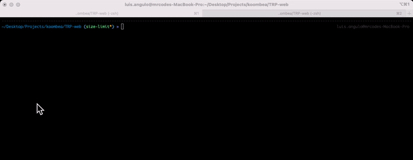

<div align="center">
    <h1>
        
        <a href="https://www.troweprice.com/corporate/us/en/home.html">TRowePrice</a>
    </h1>
    <h4><b>Frontend internal seller demo app for TrowePrice</b></h4>
    <h4>
        <a href="#links">Links</a>
        •
        <a href="#versions">Versions</a>
        •
        <a href="#roadmap">Roadmap</a>
        •
        <a href="#development-guide">Development guide</a>
        •
        <a href="#deployment">Deployment</a>
        •
        <a href="#contact">Contact</a>
        •
        <a href="#copyright">Copyright</a>
    </h4>
    <h3>
        <a href="https://www.github.com/koombea">
          
        </a>
        <a href="https://www.github.com/pipe2442">
          
        </a>
        <a href="https://www.github.com/dmunoz-10">
          
        </a>
        <a href="https://www.github.com/lacides">
          
        </a>
        <a href="https://www.github.com/luiskhernandez">
          
        </a>
        <a href="https://www.troweprice.com/corporate/us/en/home.html">
            
        </a>
        <a href="##License">
            
        </a>
    </h3>
</div>


## Overview

T. Rowe Price is an independent investment management firm focused on helping clients meet their objectives and achieve their long-term financial goals. Clients rely on our active management approach, which we call strategic investing, and our broad range of equity, fixed income, and multi-asset investment capabilities.

## Built With

- [React](https://reactjs.org/).
- [Vite](https://vitejs.dev/).
- [Yarn](https://yarnpkg.com/).
- [Typescript](https://www.typescriptlang.org/)
- [TailwindCss](https://tailwindcss.com/).
- [Eslint](https://eslint.org/).
- [Prettier](https://prettier.io/).
- [Jest](https://jestjs.io/). 
- [Cypress](https://www.cypress.io/).
- [Storybook](https://storybook.js.org/).
- [SizeLimit](https://github.com/ai/size-limit).
- [Commitizen](https://github.com/commitizen/cz-cli). 
- [VictoryChart](https://formidable.com/open-source/victory/docs/victory-chart/).
- [Git](https://git-scm.com/).

## Getting Started

### Clone the project on your local machine.

Run the following command on your local directory.

```bash
$ git clone git@github.com:koombea/TRP-web.git
```

### Install dependencies

```bash
$ yarn install
```

### Run development environment.

```bash
$ yarn dev
```

### Editor extensions (Optional)

It's recommended to install extensions related to the following libraries in your editor:

- [Eslint](https://marketplace.visualstudio.com/items?itemName=dbaeumer.vscode-eslint).
- [Prettier](https://marketplace.visualstudio.com/items?itemName=esbenp.prettier-vscode).

### Set up pre-commits

Run the following command to set up [commitizen](https://github.com/commitizen/cz-cli) for pre-commits. This will prevent commits with linting errors.

```bash
$ npx commitizen init cz-conventional-changelog --save-dev --save-exact
```

Every time you want to add a new commit to this project instead of using `git commit -m 'commit message'` you can use `npx cz` to write commit messages with no lint errors. Additional info and docs can be found [here](https://github.com/commitizen/cz-cli).

## Conventions

### Code Styles

- [Eslint](https://eslint.org/).
  - For this project code style we are using [Standard](https://standardjs.com/) with [Eslint](https://eslint.org/).
- [Prettier](https://marketplace.visualstudio.com/items?itemName=esbenp.prettier-vscode).
  - As code formatter we are using [Prettier](https://marketplace.visualstudio.com/items?itemName=esbenp.prettier-vscode).

### Commits
- [Commitizen](https://github.com/commitizen/cz-cli) 
  - For commits convention we are using [commitizen](https://github.com/commitizen/cz-cli).

### Supported Web Browsers

All recent web browsers. Some of them:

- Google Chrome
- Mozilla Firefox
- Microsoft Edge
- Brave
- Safari
- Opera

## Size-limit

In order to calculate the real cost of this project, new features and implementations are written based on the bundler size limit. For this purpose, we are using [size-limit](https://github.com/ai/size-limit) as a performance budget tool. Every pull request will run a GitHub workflow that returns the bundle size, running time, and loading time to keep a record of the cost for each new feature or implementation. More information and docs can be found [here](https://github.com/ai/size-limit).



## Environments

### Production

[add a link and a description of this environment]: text

### UAT

[add a link and a description of this environment]: text

### Staging

[add a link and a description of this environment]: text

## Troubleshooting

[list and describe steps to help solving any known issue (e.g: rollbacks, certificates issues, etc).]: text

## Contributing

The `main` branch of this repository contains the latest stable source code for the production environment. This branch and the `develop` branch are protected to prevent those from being accidentally deleted. Force pushes are also disabled to enforce following the process described in the [Releasing](#releasing) section.

Please follow this steps for submitting any changes:

1. Create a new branch for any new feature.
2. Make sure you include tests for your changes.
3. When the feature is complete, create a pull request to the develop branch.
4. After approving the pull request, squash and merge the changes.
5. Finally, remove the branch locally and remotely (after merging, Github removes the remote branch automatically).

### Continuous Integration

When a pull requests is submitted to the `develop` branch the CI service will automatically run the tests and generate a new build for testing. A message will be posted to the team's slack channel.

For more information, see our [CONTRIBUTING](CONTRIBUTING.md) guide.

## Releasing

All releases to the main branches (`main` and `develop`) must be code reviewed and approved before being merged by the team's _Release Manager_ following this steps:

1. After a pull request is submitted, the developer must assign the teammates to make a code review.
2. Once the code review is finished and changes are approved, the _QA Analyst_ would be automatically(?) notified to do the smoke testing.
3. If all tests passes, and the _QA Analyst_ does not find any issue the code can be merged by the _Release Manager_.
4. When all the features planned for a release are done, the _Release Manager_ will be in charge of approving and merging the changes to the `main` branch.
5. The _QA Analyst_ must do a full regression test of the production environment to make sure the new changes did not affect any other functionality.

[note: each pull request must include the following checklist]: text

### Continuous Integration

When a change is merged into the `develop` branch the CI service will automatically run the tests and generate a new build for staging. A message will be posted to the team's slack channel.

When a change is merged into the `master` branch the CI service will automatically run the tests and generate a new build for production. A message will be posted to the team's slack channel.

For more information, see our [CONTRIBUTING](CONTRIBUTING.md) guide.

## License

Copyright © 2022 Koombea®. All rights reserved.
